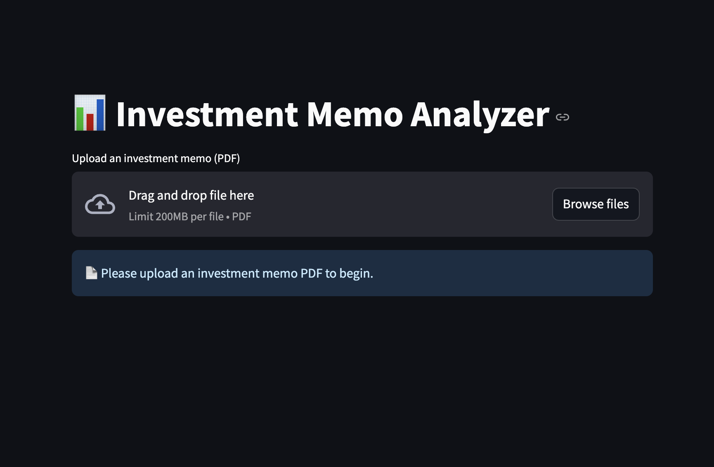
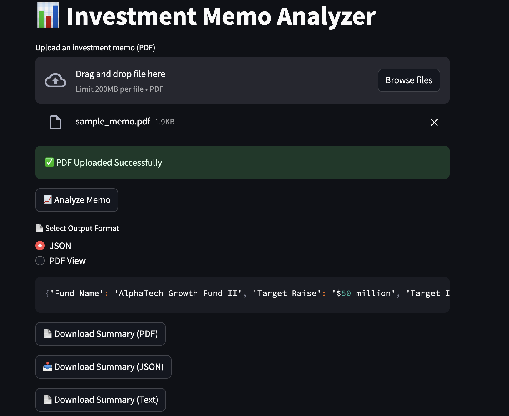
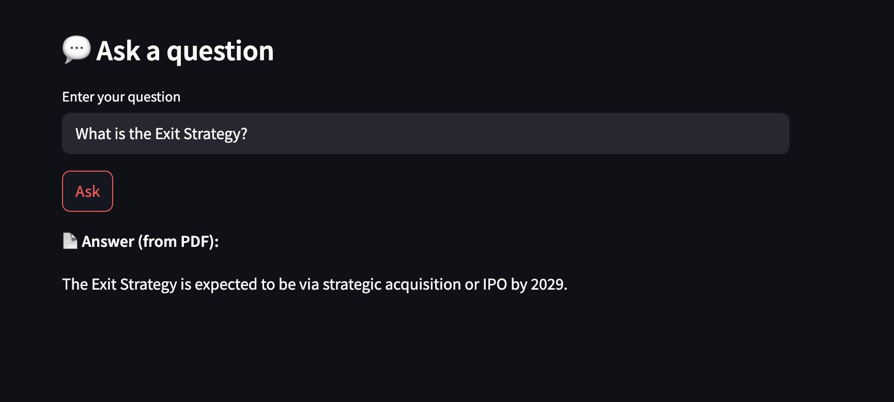
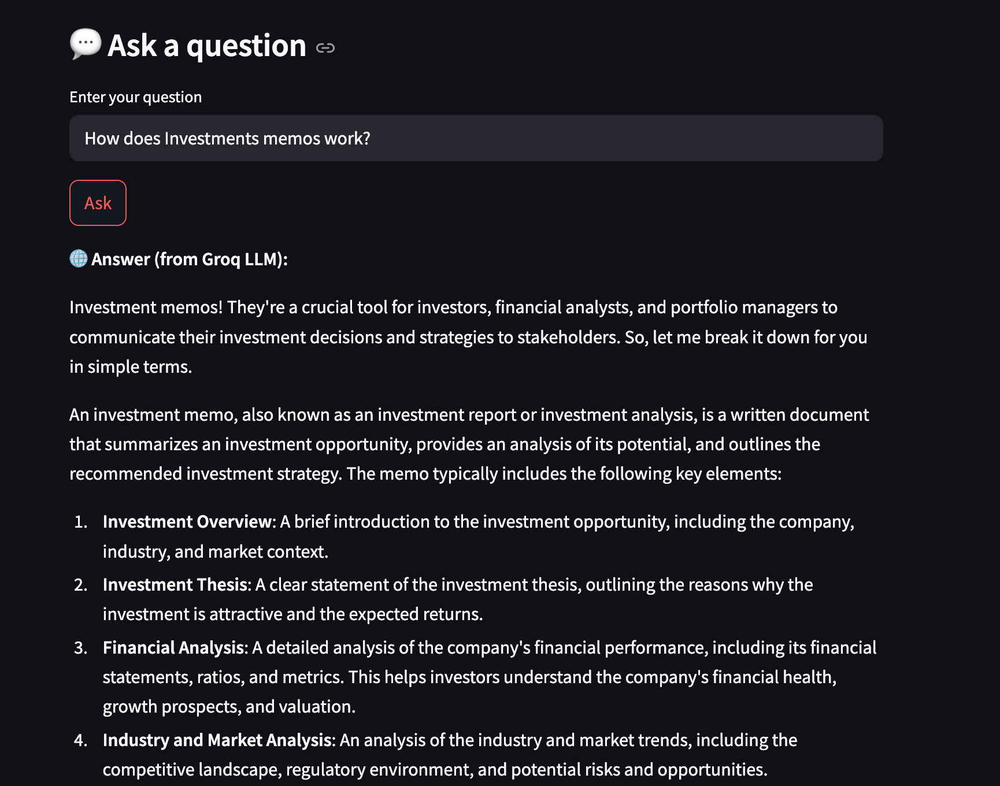

# 📊 Investment Memo Analyzer

This application extracts structured insights from investment memo PDFs using LLM-based summarization and RAG-based Q\&A. Built with Streamlit, it supports dynamic JSON/PDF views and download options.

---

## 🚀 Features

* 📤 Upload PDF investment memos
* 🧠 Summarize memos with Groq LLM
* 📄 Toggle between JSON and PDF view
* 💬 Ask finance-related questions (RAG + LLM)
* 📥 Download results in JSON, PDF, or Text format

---

## 🛠️ Tech Stack

* **Frontend/UI:** Streamlit
* **LLM Backend:** Groq LLM (LLaMA3-8B)
* **Embeddings:** HuggingFace Transformers
* **Vector Store:** ChromaDB
* **PDF Parsing:** PyMuPDF (fitz)
* **Download Formatters:** FPDF, JSON
* **Others:** LangChain (RAG Chain), Python 3

---

## 📁 Project Structure

```bash
investment-memo-analyzer/
├── app.py                          # Streamlit main app
├── requirements.txt               # Dependencies
├── README.md                      # Project documentation
├── screenshots                    # Demo Screenshots

└── utils/
    ├── download_utils.py          # Logic for generating PDF/JSON/Text downloads
    ├── llm.py                     # Groq LLM wrapper
    ├── pdf_utils.py               # Extract text from PDF using fitz
    ├── qa_chain.py                # RAG chain setup for hybrid answering
    └── summary_extractor.py       # Prompt & summarization logic
```

---

## 🧪 Setup Instructions

```bash
# Clone the repository
$ git clone https://github.com/your-username/investment-memo-analyzer
$ cd investment-memo-analyzer

# Create a virtual environment
$ python -m venv venv
$ source venv/bin/activate  # Windows: venv\Scripts\activate

# Install dependencies
$ pip install -r requirements.txt

# Run the Streamlit app
$ streamlit run app.py
```

---


## 📸 Screenshots

### 1. Upload PDF


### 2. Extracted JSON Output and Download Options


### 3. Q&A 


### 4. Q&A (Fall back LLM)


---

## 🔗 Sample Usage

1. Upload a PDF memo.
2. Click **Analyze Memo** → summarized JSON appears.
3. Toggle between JSON/PDF view.
4. Ask a follow-up question about the memo.
5. Download insights as `.json`, `.pdf`, or `.txt`

---


## ✨ Prompt Engineering Strategy

We use a role-specific instruction prompt to ensure the LLM extracts key investment fields as a clean JSON object. Prompt includes examples and a character-limited input buffer to maintain token size. Output is post-validated using regex + `json.loads()` for reliable parsing.

---
## 📬 Contact

Built by [Akhileswari Pemmanaboina](mailto:akhileswari712@gmail.com)

Feel free to fork, improve, and contribute!


---

> 💡 This project showcases the fusion of AI + FinTech. Perfect for investors, analysts, and researchers!
